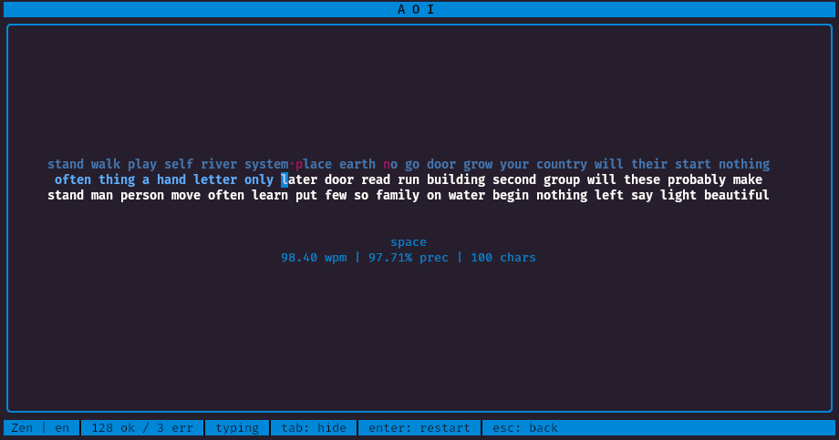

<div align="center">
  
</div>

<h1 align="center">🔹 あおい 🔹</h1>

<p align="center"> 
  A terminal-based typing test. 
  <br>
  Practice your typing, relax and vibe with aoi.
</p>

<div align="center">

  
  
  
  

  <br>

  <a href="https://www.buymeacoffee.com/aelxand" target="_blank">
    
  </a>

  <br>

  <a href="README-ptBR.md">
    (README 🇧🇷)
  </a>
</div>

## What is Aoi?

I started to like doing typing tests for hobby and keeping my digitation skills sharp, but always wanted it in a TUI. So i made AOI!

Choose 4 different modes of typing practice in Aoi:
- Zen: Type infinitely at your own pace
- Timed: Race against the clock
- Count: Type a fixed number of words
- Quote: Type a random quote

Configure the colors anyway you like. You can also add more words or quotes, scalable to use any language you want!

<div align="center">
  
</div>

## Installation

### Prerequisites

- Go 1.24+ (required for building from source)
- Terminal emulator that supports ANSI colors and Unicode

### Installation Methods

#### Method 1: Install using Go

```bash
# Make sure you have Go configured to your ~/.zshrc or ~/.bashrc
export GOPATH=$HOME/go
export PATH=$PATH:$GOPATH/bin

# Close the terminal or run to apply
source ~/.zshrc 
# Or
source ~/.bashrc

# Finally, install directly from GitHub
go install -a github.com/AlexandreSJ/aoi/cmd/aoi@latest
```

#### Method 2: Build from Source (for developers)

```bash
# Clone the repository
git clone https://github.com/AlexandreSJ/aoi.git
cd aoi

# Build the application
make build
```

### Quick Start

After installation, simply run:

```bash
aoi
```

### Build Commands

If you have the git repo installed, ond /aoi you can run:

```bash
make clean  # Remove /build directory
make build  # Compile the binary
make run    # Build and run immediately
```

### Features

- **Lightweight and fast** - Light and quick as a hedgehog
- **Real-time typing feedback** - See your accuracy and speed as you type
- **Unicode support** - Works with various character sets
- **Responsive design** - Adapts to different terminal sizes

### System Requirements

- **Operating System**: Linux, macOS, or Windows (with WSL)
- **Terminal**: Any modern terminal emulator (Terminal, iTerm2, Alacritty, Windows Terminal, etc.)
- **Disk Space**: ~5MB for the binary

### Troubleshooting

**Q: I get "command not found: aoi"**
A: Make sure your GOPATH/bin directory is in your PATH, or use the full path to the binary.

**Q: The colors look strange in my terminal**
A: Try setting `TERM=xterm-256color` or use a terminal that supports true color.

**Q: The application won't start**
A: Ensure you have Go 1.24+ installed and that your terminal supports Unicode characters.

**Q: I am having trouble installing/updating aoi to the latest version**
A: If you already have Go installed, run the following command to avoid the proxy.golang.org and use `-a` tag to force rebuild:
`GOPROXY=direct go install -a github.com/AlexandreSJ/aoi/cmd/aoi@latest`

<div align="center">
  <a href="https://git.io/typing-svg">
    
  </a>
</div>

